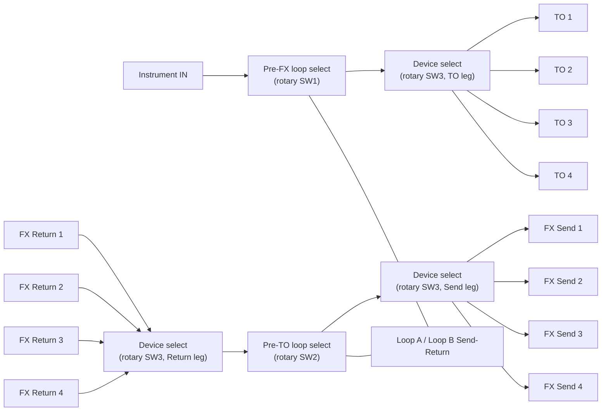

# 4 Lane Trafik

## Purpose

The 4 Lane Trafik is the full product configuration: four selectable device paths, two independently controlled pedal-loop positions, and a center lane-selection footswitch. It uses the three-foot-switch layout established for the family.

## Panel layout and connections

Use a metal enclosure approximately 1590XX size or equivalent, subject to a full-size fit check.

- Right side: one **Instrument IN** jack.
- Top-left bank: **FX Return 1–4**.
- Top-right bank: **FX Send 1–4**.
- Left side: Loop B Send/Return in the upper position and Loop A Send/Return below it.
- Bottom bank: **TO 1–4**.
- Across the middle: left **Pre-FX**, center **Device**, right **Pre-TO** momentary footswitches.
- Indicators: four loop-state indicators for each pedal position near the TO bank and between the FX banks; four device-lane indicators beside the center switch.
- DC input on a side panel, away from audio conductors.

There are seventeen audio jacks total: Instrument IN, four TO outputs, eight device FX jacks, and four pedal-loop jacks. Use mono ¼-inch TS connectors. Panel labeling and jack direction follow the [architecture](architecture.md).

The three large middle circles in the agreed layout are the footswitches. The small rectangles beside the TO bank and between the FX banks are pedal-loop state indicators; they are not audio connections.

## Routing

The selected lane is the only connected device path:

`Instrument IN → Pre-FX position → TO n → device n input`

`device n FX Send → FX Return n → Pre-TO position → FX Send n → device n FX Return`

The center switch selects lane 1, 2, 3, or 4; only the corresponding TO output and FX pair are connected. All other lane jacks remain isolated. Each outer switch selects Off, Loop A, Loop B, or A→B at its signal position. Loop A is first in the series chain. Each physical loop can appear at only one position; if both positions request it, Pre-FX has priority and the indicator reports the actual applied state.

## Footswitch and LED behavior

- **Left / Pre-FX:** first press A; second B; third A→B; fourth Off; repeat.
- **Center / Device:** selects 1 → 2 → 3 → 4 → 1.
- **Right / Pre-TO:** first press A; second B; third A→B; fourth Off; repeat.

Each loop position has four state indicators labeled Off, A, B, and A→B. Four lane indicators identify the selected device path. Only the active state/lane is lit. At power-up, both loop positions reset Off and lane 1 is selected.

## Circuit Design

This section documents **Option A (mechanical stepping switch, default)**. See [architecture.md](architecture.md#circuit-design-principles) for the Option A/B distinction and shared conventions, and the "Hardware implementation" section below for Option B (relay-based).

### Signal path

### Loop switch logic table (SW1 = Pre-FX, SW2 = Pre-TO)

Identical to the Single Lane loop-select stage — see [single-lane-PLACEHOLDER.md](single-lane-PLACEHOLDER.md#switch-logic-table-per-position-sw1--pre-fx-sw2--pre-to) for the full 4-position table. Each position uses one 4-position, minimum 3-pole, non-shorting rotary switch (3P4T).

### Device (lane) switch logic table (SW3)

The device selector is one **4-position, minimum 3-pole (3P4T)** non-shorting rotary switch (same class of part as the loop-select switches, wired for a different function). Three ganged poles move together:

| Position | Pole 1 (TO) | Pole 2 (FX Return, into Pre-TO) | Pole 3 (FX Send, from Pre-TO) | Lane LED |
| --- | --- | --- | --- | --- |
| 1 | Pre-FX output → TO 1 | FX Return 1 → Pre-TO input | Pre-TO output → FX Send 1 | Lane 1 |
| 2 | Pre-FX output → TO 2 | FX Return 2 → Pre-TO input | Pre-TO output → FX Send 2 | Lane 2 |
| 3 | Pre-FX output → TO 3 | FX Return 3 → Pre-TO input | Pre-TO output → FX Send 3 | Lane 3 |
| 4 | Pre-FX output → TO 4 | FX Return 4 → Pre-TO input | Pre-TO output → FX Send 4 | Lane 4 |

Break-before-make contacts are required so no two TO outputs (or FX Send outputs) are ever briefly joined during a position change.

### Electronics needed

- 3 × 4-position, minimum 3-pole, non-shorting rotary switch (2 for loop select, 1 for device select — all the same part class, wired differently).
- 17 × mono ¼-inch TS jack (Instrument IN, TO 1–4, FX Send 1–4, FX Return 1–4, Loop A/B Send/Return).
- 12 × indicator LED (4 per loop position + 4 lane LEDs) with series resistors.
- Optional: 9 V battery or DC jack, only if LEDs are fitted.

See [electronics-reference.md](electronics-reference.md) for full specifications and this variant's exact quantities.

### LED wiring (Option A)

Loop-position LEDs follow the same table as [Single Lane](single-lane-PLACEHOLDER.md#led-wiring-option-a). Lane LEDs are wired to SW3's spare deck, one contact per lane, all the same color (white/blue), with only the selected lane's LED lit at a time.

## Hardware implementation (Option B — relay-based, alternative)

Use debounced momentary footswitches, fixed-function CMOS counters and decoders, transistor relay drivers, and low-level audio relays. The lane counter wraps after lane 4. Use relay groups to switch each lane’s TO and FX pair as one selection, with break-before-make behavior. Unselected lanes must remain isolated. The loop allocation interlock is required to prevent either pedal chain being inserted into both signal paths; derive the state LEDs from the interlocked outputs. Relay contacts provide a passive audio path; the 9 V supply operates only logic and coils.

## Build quantity and estimate

See the [BOM](bom-PLACEHOLDER.md) for line-item parts and retailer alternatives. The current planning estimate is **$254.00** before tax/shipping and **$292.10** with a 15% sourcing reserve. This estimate excludes tools, labor, and an external pedalboard power supply.

## Checkout

Verify every lane’s TO and corresponding FX route individually. Confirm the other three lanes remain isolated during each selection, then check both loop cycles, loop ordering, allocation interlock, indicators, power-up reset, and unpowered bypass. Complete the [build guide](build-guide.md) before connecting amplifiers or pedals.
