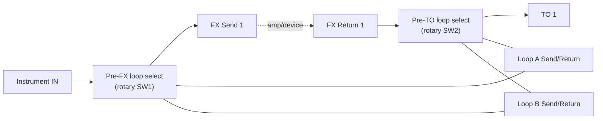

# Single Lane Trafik

## Purpose

The Single Lane Trafik provides the same two pedal-loop insertion positions as the multi-lane models, but has one fixed device path and no device-selection footswitch. Two momentary footswitches independently select which pedal loops are active at the Pre-FX and Pre-TO positions.

## Panel layout and connections

Use a metal enclosure approximately 1590B size or equivalent, subject to a full-size fit check.

- Right side: one **Instrument IN** jack.
- Upper-left bank: one **FX Return 1** jack.
- Upper-right bank: one **FX Send 1** jack.
- Left edge: **Loop B Send** above **Loop B Return**, then **Loop A Send** above **Loop A Return**.
- Bottom bank: one **TO 1** jack.
- Across the middle: left **Pre-FX** footswitch and right **Pre-TO** footswitch.
- Indicators: four-state Pre-FX indicator near TO; four-state Pre-TO indicator between the FX banks.
- DC input and any status/ground-lift hardware go on an otherwise clear side panel.

There are eight audio jacks total: Instrument IN, TO 1, FX Send 1, FX Return 1, and the four Loop A/B send/return jacks. Use mono ¼-inch TS jacks.

## Routing

`Instrument IN → Pre-FX position → TO 1 → device input`

`device FX Send → FX Return 1 → Pre-TO position → FX Send 1 → device FX Return`

At each position the physical Loop A and Loop B paths can be bypassed, inserted individually, or placed in series in the order A then B. When both positions request the same physical loop, it is assigned to Pre-FX and omitted at Pre-TO. The indicators report the resulting applied state. This prevents the same external pedal chain from being inserted twice.

## Footswitch and LED behavior

Each footswitch advances its own position through the following sequence:

1. First press: Loop A
2. Second press: Loop B
3. Third press: Loop A → Loop B
4. Fourth press: Off
5. The next press returns to Loop A

Each position has four indicators, labeled Off, A, B, and A→B. Exactly one is lit to show the applied routing; if interlock priority changes a requested state, the LEDs show the state actually in circuit. At power-up, both positions reset to Off. There is no lane indicator or device-selection control; TO 1 and its FX pair are permanently the device path.

## Circuit Design

This section documents **Option A (mechanical stepping switch, default)**. See [architecture.md](architecture.md#circuit-design-principles) for the Option A/B distinction and shared conventions, and the "Hardware implementation" section below for Option B (relay-based).

### Signal path

Loop A and Loop B jacks are wired once and shared between the two rotary switches; the loop-allocation interlock (see [architecture.md](architecture.md#signal-paths)) means only one of SW1/SW2 can have a given loop engaged at a time — this is enforced by wiring, not logic, by leaving each loop's Send lug permanently connected to only one switch's common bus per build (see [build guide](build-guide.md) for the recommended fixed allocation if both positions are wired to both loops).

### Switch logic table (per position, SW1 = Pre-FX, SW2 = Pre-TO)

Each position uses one non-shorting, break-before-make rotary switch: minimum **3 poles × 4 throws (3P4T)**, or a common 4P4T switch with one deck unused/repurposed for LED commons.

| Position | Pole 1 (signal-in) | Pole 2 (Loop A Return) | Pole 3 (Loop B Return) | Resulting path |
| --- | --- | --- | --- | --- |
| 1 — Off | → next stage directly | not connected | not connected | Straight through, both loops bypassed |
| 2 — A | → Loop A Send | → next stage | not connected | Signal → Loop A → next stage |
| 3 — B | → Loop B Send | not connected | → next stage | Signal → Loop B → next stage |
| 4 — A→B | → Loop A Send | → Loop B Send | → next stage | Signal → Loop A → Loop B → next stage |

"Next stage" is FX Send 1 for SW1 (Pre-FX) and TO 1 for SW2 (Pre-TO). Rotating the shaft one detent per manual push (via a simple foot-actuated stepping mechanism, or directly as a panel-mount rotary footswitch) reproduces the "press to advance" behavior without any counter.

### Electronics needed

- 2 × 4-position, minimum 3-pole, non-shorting rotary switch (loop select), foot-actuated or panel-mount per [electronics-reference.md](electronics-reference.md#loop-select-switch).
- 8 × mono ¼-inch TS jack (Instrument IN, TO 1, FX Send 1, FX Return 1, Loop A/B Send/Return).
- 8 × indicator LED (4 per position) with series resistors.
- Optional: 9 V battery or DC jack, only if LEDs are fitted.

See [electronics-reference.md](electronics-reference.md) for full specifications, and the comparison table there for this variant's exact quantities.

### LED wiring (Option A)

Each position's four LEDs are wired directly to the rotary switch's spare deck (or to the pole already used for signal, via a high-impedance tap, is **not** recommended — use a dedicated LED deck) so that only the LED for the active throw is lit, with no decode logic:

| State | LED lit | Color |
| --- | --- | --- |
| Off | Off-state LED | Unlit (or a single shared "power" LED, optional) |
| A | Loop A LED | Green |
| B | Loop B LED | Red |
| A→B | Combined LED | Amber / bi-color (green+red) |

Resistor sizing example at 9 V: R = (Vsupply − Vf) / I = (9 V − 2 V) / 10 mA ≈ 700 Ω → use 680 Ω (nearest standard value, 1/4 W).

## Hardware implementation (Option B — relay-based, alternative)

Use two independent debounced CMOS four-state counters, relay drivers and low-level audio signal relays. Each loop position requires relay contacts for bypass/insert selection, and the loop-allocation interlock must prevent either physical loop from appearing in both positions. Use break-before-make switching on the selected device FX path. The loop LEDs are driven from the applied-state decoder, not the raw footswitch counter.

The loop counter advances on a momentary normally-open footswitch closure. On power loss, relays return to their unpowered bypass condition; the control reset starts both counters at Off when power is restored. Use the relay contact arrangement so a failure or loss of control power does not leave a pedal loop connected in series unexpectedly.

## Build quantity and estimate

See the [BOM](bom-PLACEHOLDER.md) for line-item parts and retailer alternatives. The current planning estimate is **$142.40** before tax/shipping and **$163.76** with a 15% sourcing reserve. This estimate excludes tools, labor, and an external pedalboard power supply.

## Checkout

Verify continuity and each loop state independently before connecting an amplifier. Then check the two insertion positions, loop-allocation interlock, silent/low-noise relay changes, power-up reset, and power-loss bypass using the [build guide](build-guide.md).
