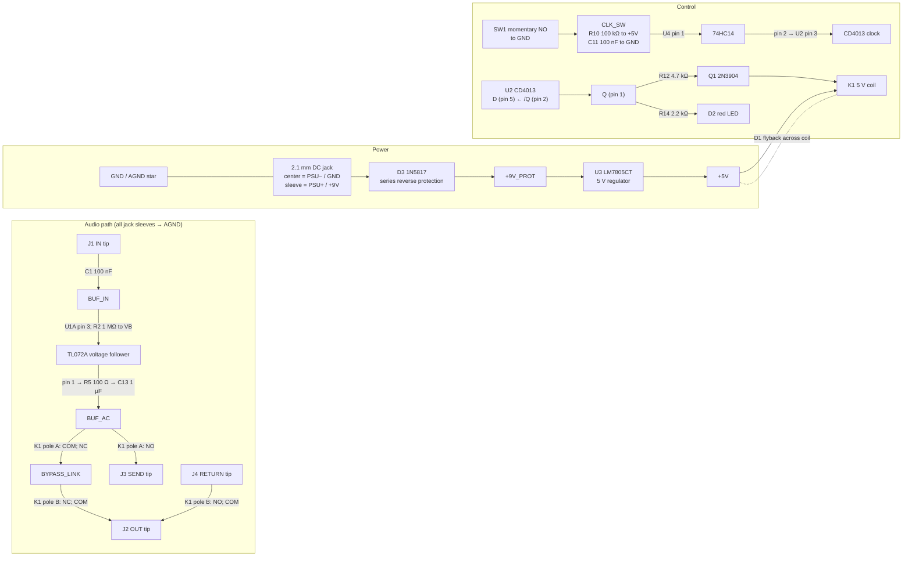

# Single-loop Trafik prototype circuit

> **Prototype warning:** This is a build-and-test reference, not a certified or production-verified design. Before connecting pedals, verify PSU polarity, current draw, regulator temperature, relay coil/contact ratings, contact mapping, audio pops, and signal behavior with a current-limited supply and a low-level test signal. Do not connect expensive pedals until the checklist below passes.

## Scope and relationship to Single Lane Trafik

This document records a **separate, one-loop bench prototype** based on the earlier proposed circuit: buffered input, one relay-bypassed send/return loop, one soft-touch switch, one state LED, and a 9 V pedal supply. It is not the complete Single Lane Trafik product described in [single-lane-PLACEHOLDER.md](single-lane-PLACEHOLDER.md), which has two independently controlled loop positions and the fixed device FX path. It also does not replace the product routing and control requirements in [architecture.md](architecture.md).

The buffer is active, but the signal at all four audio jacks is AC-coupled and referenced to audio ground. The relay's **de-energized** contact state bypasses the external loop; its energized state inserts the loop. This is not a hardwire true-bypass or power-off signal path: with DC removed the buffer stops operating, even though the relay returns to its loop-bypass contacts. The control logic uses a CD4013 toggle flip-flop and a Schmitt-trigger debounce gate.

## Circuit diagram

The diagram uses named nets; the pin-by-pin wiring table below is authoritative if a renderer lays out the diagram differently. K1 contacts are functional COM/NC/NO names, not physical relay pin numbers.

### Relay contact function

Use a **Panasonic TQ2-5V, non-latching, DPDT** relay for this wiring. Identify the terminals from the datasheet drawing for the exact ordering code and package/view; do not infer pin numbers from this diagram.

| Pole | COM | NC (relay de-energized; bypass) | NO (relay energized; loop inserted) |
| --- | --- | --- | --- |
| A | `BUF_AC` | `BYPASS_LINK` | `SEND_TIP` |
| B | `OUT_TIP` | `BYPASS_LINK` | `RETURN_TIP` |

When de-energized, the path is `BUF_AC → BYPASS_LINK → OUT_TIP`. When energized, it is `BUF_AC → SEND_TIP` and `RETURN_TIP → OUT_TIP`. All jack sleeves connect to the shared audio ground. The selected relay's data sheet and footprint must confirm its contacts, coil, terminal-view orientation, ratings, and coil suppression requirements.

**Do not substitute TQ2-L2-5V without redesigning the driver.** The `-L2` model is a two-coil latching relay: set/reset pulses operate it, it retains its state without power, and its coil must not be driven continuously from the CD4013 outputs. That substitution also removes the de-energized-bypass behavior. A latching version needs a datasheet-validated pulse circuit and a separately designed power-up/power-loss state.

## Named-net wiring table

`GND` is the one 0 V reference for the DC supply, logic, and audio sleeves. `VB` is only the TL072's approximately 4.5 V signal bias; **never** connect `VB` to a jack sleeve, relay contact, or DC ground in place of `GND`.

### Power, bias, and IC pins

| Part/pin | Connect to | Notes |
| --- | --- | --- |
| DC jack center contact | `GND` / PSU negative | Standard center-negative pedal supply polarity. |
| DC jack outer sleeve contact | `PSU_9V_RAW` / PSU positive | This is **not ground**. Mark the jack and board clearly. |
| D3 1N5817 anode | `PSU_9V_RAW` | Series reverse-polarity protection. |
| D3 cathode | `+9V_PROT` | Protected positive supply; all following +9 V connections use this net. |
| C5 10 µF positive; C5b 100 nF | `+9V_PROT` | C5 negative and C5b other terminal to `GND`; place near U3/U1. |
| R3 1 MΩ | `+9V_PROT` to `VB` | Upper half of bias divider. |
| R4 1 MΩ | `VB` to `GND` | Lower half of bias divider. |
| C2 10 µF positive; C3 100 nF | `VB` | Other terminals to `GND`; locate by the divider/U1. |
| U3 LM7805CT TO-220 pin 1 (IN) | `+9V_PROT` | View the package face/lead orientation in the exact manufacturer's datasheet. |
| U3 pin 2 (GND/tab) | `GND` | Tab is normally ground on this package; insulate if attached to a grounded chassis/heatsink. |
| U3 pin 3 (OUT) | `+5V` | Confirm the chosen manufacturer's package pinout before soldering. |
| C6 330 nF | U3 pin 1 to `GND` | Close to regulator input. |
| C7 100 nF and C8 10 µF positive | `+5V` | Other terminals to `GND`; close to regulator output. |
| U1 TL072CP pin 8 (V+) | `+9V_PROT` |  |
| U1 pin 4 (V−) | `GND` | Single-supply circuit; do not connect this pin to `VB`. |
| C4 100 nF | U1 pins 8 to 4 | Local rail bypass, close to the IC. |
| U1 pin 3 (A+) | `BUF_IN` | Also R2 1 MΩ to `VB`. |
| U1 pin 2 (A−) | U1 pin 1 | Unity-gain voltage follower. |
| U1 pin 1 (A out) | R5 100 Ω, then C13 1 µF film, then `BUF_AC` | C13 is in series; its output side is `BUF_AC`. |
| U1 pin 5 (B+) | `VB` | Keeps unused amplifier channel at a defined bias. |
| U1 pins 6 (B−) and 7 (B out) | Tie together | Configures unused channel as a unity follower at `VB`; do not leave inputs floating. |

The LM7805 is a linear regulator. Its approximate dissipation is `(V_IN − 5 V) × I_5V`; check package temperature in the closed enclosure and do not assume a regulator's headline current rating is available without adequate cooling.

The TL072 is not a rail-to-rail amplifier. Its input common-mode range and output swing limit the available headroom on a single 9 V supply; confirm the largest expected pickup/transient signal does not clip. If it does, choose and validate a more suitable single-supply buffer rather than assuming the TL072 behaves like a rail-to-rail device.

### Audio connectors and contacts

| Net/component | Connection |
| --- | --- |
| J1 Instrument IN tip | `IN_TIP`; R1 1 MΩ from `IN_TIP` to `GND`; C1 100 nF from `IN_TIP` to `BUF_IN`. |
| C1 | Series coupling capacitor between `IN_TIP` and `BUF_IN`. |
| R2 1 MΩ | `BUF_IN` to `VB`. |
| R5 100 Ω | U1 pin 1 to C13 input. |
| C13 1 µF film | R5 output to `BUF_AC`. |
| R6 1 MΩ | `BUF_AC` to `GND`. |
| K1 pole A COM | `BUF_AC`. |
| K1 pole A NC | `BYPASS_LINK`. |
| K1 pole A NO | `SEND_TIP` (J3 send jack tip). |
| K1 pole B NC | `BYPASS_LINK` (join to pole A NC). |
| K1 pole B COM | `OUT_TIP` (J2 output jack tip). |
| K1 pole B NO | `RETURN_TIP` (J4 return jack tip). |
| R7 1 MΩ | `SEND_TIP` to `GND`. |
| R8 1 MΩ | `RETURN_TIP` to `GND`. |
| R9 1 MΩ | `OUT_TIP` to `GND`. |
| J1, J2, J3, J4 sleeves | `AGND`; join to `GND` at the audio/power star point. |

Use isolated TS jacks if possible. If metal jack sleeves bond to the enclosure, prevent multiple unintended chassis bonds; make one deliberate enclosure bond at the ground star.

### Switch, logic, LED, and relay driver

| Part/pin | Connect to | Notes |
| --- | --- | --- |
| U4 SN74HC14N pin 14 | `+5V` |  |
| U4 pin 7 | `GND` |  |
| C10 100 nF | U4 pins 14 to 7 | Local decoupling. |
| SW1 normally-open contact 1 | `CLK_SW` | Momentary soft-touch switch; its contacts carry no audio. |
| SW1 normally-open contact 2 | `GND` | Press connects `CLK_SW` to ground. |
| R10 100 kΩ | `+5V` to `CLK_SW` | Pull-up. |
| C11 100 nF | `CLK_SW` to `GND` | RC debounce with U4's Schmitt input. |
| U4 pin 1 (1A) | `CLK_SW` |  |
| U4 pin 2 (1Y) | U2 pin 3 | Clean clock edge. |
| U4 unused input pins 3, 5, 9, 11, 13 | `GND` | Tie unused CMOS inputs to a defined level. Leave their output pins 4, 6, 8, 10, 12 unconnected. |
| U2 CD4013BE pin 14 (VDD) | `+5V` |  |
| U2 pin 7 (VSS) | `GND` |  |
| C9 100 nF | U2 pins 14 to 7 | Local decoupling. |
| U2 pin 3 (CLK1) | U4 pin 2 | One positive clock edge per switch press after debounce. |
| U2 pin 5 (D1) | U2 pin 2 (`/Q1`) | Toggle configuration. |
| U2 pin 6 (SET1) | `GND` | Active-high asynchronous set held inactive. |
| U2 pin 4 (RESET1) | `RESET1` | Active-high reset; R11 100 kΩ from this net to `GND`, C12 100 nF from `+5V` to this net for power-up reset to Q=0. |
| U2 pin 1 (Q1) | `Q_STATE` | High means loop on. |
| U2 pin 2 (`/Q1`) | U2 pin 5 and otherwise NC |  |
| U2 unused flip-flop pins 8 (D2), 9 (CLK2), 10 (RESET2), 11 (SET2) | `GND` | All unused CMOS inputs tied low; pins 12/13 outputs unconnected. |
| R12 4.7 kΩ | `Q_STATE` to Q1 base | Base-current limiter. |
| R13 100 kΩ | Q1 base to `GND` | Holds driver off during reset/power-up. |
| Q1 2N3904 emitter | `GND` | Verify the exact manufacturer's transistor lead order; use E/B/C functional terminals. |
| Q1 collector | K1 coil low side (`COIL−`) |  |
| K1 coil other terminal (`COIL+`) | `+5V` | TQ2-5V is non-latching; the coil is energized for the entire loop-on state. |
| D1 1N4148 cathode | `COIL+` | Flyback diode directly across the coil. |
| D1 anode | `COIL−` | Confirm orientation before applying power. |
| R14 2.2 kΩ | `Q_STATE` to D2 LED anode |  |
| D2 red LED cathode | `GND` | Lit means loop-on. |

CD4013 power-up reset is an RC startup aid, not a precision reset supervisor; test it with slow supply ramps and power cycling. If it does not reliably reset at the actual supply ramp, add a suitable reset supervisor rather than relying on a floating or manually forced input.

### Signal and grounding details

- The divider creates `VB` near half the protected 9 V rail. U1's input/output idle around `VB`; C13 removes this DC bias before the relay and external pedal jacks. `BUF_AC`, send, return, output, and every jack sleeve are ground-referenced audio nets.
- `VB` is a signal-bias node, **not** ground. Its only reference to ground is through R4 and its decoupling capacitors.
- Join audio sleeve returns at `AGND`; route regulator, logic, and relay-coil return currents separately to the same `GND` star. Join `AGND` and the PSU-negative reference at that one star, not through `VB` or the enclosure.
- Keep input/high-impedance audio wiring short and away from the clock, LED, and coil wiring. Place decouplers at their IC/regulator pins.

## Suggested bill of materials

Part numbers below are specific starting suggestions, not a claim that every manufacturer's package, pinout, or revision is interchangeable. Check current manufacturer datasheets and footprints before ordering.

| Ref. | Qty. | Suggested part/model | Specification / role |
| --- | ---: | --- | --- |
| U1 | 1 | Texas Instruments **TL072CP** | Dual JFET-input op amp, DIP-8; channel A buffer, channel B tied as a biased follower. |
| U2 | 1 | Texas Instruments **CD4013BE** | Dual D flip-flop, DIP-14; one half configured as toggle. |
| U3 | 1 | Texas Instruments **LM7805CT/NOPB** | 5 V linear regulator, TO-220; verify pinout and thermal requirements. |
| U4 | 1 | Texas Instruments **SN74HC14N** | Hex Schmitt-trigger inverter, DIP-14; one gate used for switch debounce. |
| K1 | 1 | Panasonic **TQ2-5V** | Non-latching, DPDT, 5 V coil signal relay. Confirm current coil/contact ratings and terminal arrangement in the exact datasheet. Do not buy `TQ2-L2-5V` for this circuit. |
| Q1 | 1 | onsemi **2N3904BU** | NPN small-signal transistor, TO-92; coil low-side switch. Verify pin order from the selected manufacturer's datasheet. |
| D1 | 1 | onsemi **1N4148** | Coil flyback diode. |
| D3 | 1 | Vishay **1N5817-E3/54** | Series Schottky reverse-polarity protection. |
| D2 | 1 | Kingbright **WP7113ID** | Red indicator LED, 5 mm; LED polarity and forward voltage vary by color/model. |
| SW1 | 1 | Omron **B3F-1000** for bench test | Normally-open momentary pushbutton. For foot use, substitute a non-latching SPST-NO momentary stomp switch and verify its contact diagram. |
| J1–J4 | 4 | Switchcraft **12A** | Mono ¼-inch TS audio jacks; use insulated-body equivalents if preferred. |
| DC jack | 1 | Switchcraft **722A** | 2.1 mm panel-mount DC jack; identify center and outer/sleeve tabs from its datasheet and wire for center-negative. |
| R1–R4, R6–R11, R13 | As listed | Metal-film resistors | 1/4 W, 1%: 1 MΩ (R1–R4, R6–R9), 100 kΩ (R10, R11, R13). |
| R5 | 1 | Metal-film resistor | 100 Ω, 1/4 W, 1%. |
| R12 | 1 | Metal-film resistor | 4.7 kΩ, 1/4 W, 1%. |
| R14 | 1 | Metal-film resistor | 2.2 kΩ, 1/4 W, 1%. |
| C1, C3–C4, C5b, C7, C9–C12 | As listed | Ceramic/film capacitors | 100 nF; C1 and C13 use film if convenient. |
| C2, C5, C8 | 3 | Electrolytic capacitors | 10 µF, rated at least 16 V; observe polarity (C2 positive to `VB`, C5 positive to `+9V_PROT`, C8 positive to `+5V`). |
| C6 | 1 | Ceramic/film capacitor | 330 nF, regulator input bypass. |
| C13 | 1 | Film capacitor | 1 µF, series buffer-output coupling. |
| Audio / DC wiring | 1 lot | Insulated hook-up wire | Short shielded or twisted audio runs where appropriate; heat-shrink and insulated terminals. |
| Board | 1 | Perfboard or solderable prototype board | Use sockets for DIP ICs if desired; no enclosure required for bench testing. |

## First-power-up and test procedure

1. **Before power:** verify every connection against the tables; check D3, D1, D2, electrolytic polarity, regulator orientation, transistor E/B/C identification, relay contact mapping, and that `VB` is not connected to any jack sleeve. Inspect for solder bridges and loose strands.
2. **Unpowered meter checks:** measure resistance from the DC positive input to ground in both probe directions; investigate a persistent short. Check audio sleeves to `GND`, tips to sleeves for unintended shorts, and that K1 COM/NC continuity implements the bypass path when its coil is not powered.
3. **Power without ICs or relay fitted:** use a current-limited 9 V bench supply set for center-negative wiring. Confirm `+9V_PROT`, regulator `+5V`, and absence of heating. The series protection diode drops some voltage; confirm U3 still has adequate headroom.
4. **Install U1/U2/U4, leave K1 disconnected:** power again and check approximately 4.5 V at `VB`, approximately 5 V at U2/U4 supply pins, and approximately half-rail at U1 pin 1. Confirm no unexpected current or heating.
5. **Check switch and logic:** observe U2 pin 1 (`Q_STATE`) with a meter/logic probe. Each press should toggle once; startup should reset Q low. Verify the LED is off at Q=0 and on at Q=1.
6. **Check relay driver first without audio:** fit K1; use a current-limited supply and confirm its exact coil voltage/current from the selected datasheet. Q=0 must leave the relay unpowered; Q=1 energizes it and the LED follows. Check Q1 and regulator temperatures and measure total current. The non-latching coil draws current continuously while the loop is on.
7. **Continuity test:** with power off, verify COM_A–NC_A and COM_B–NC_B connect through `BYPASS_LINK`. With Q=1, verify COM_A–NO_A and COM_B–NO_B instead. Do not proceed if the exact relay's terminal mapping is uncertain.
8. **Low-level audio test:** connect a signal source and amplifier at low volume. First use a short patch cable from SEND to RETURN. Compare bypass and loop-on operation, then test with one inexpensive pedal. Listen for hum, oscillation, clicks/pops, level loss, and intermittent contacts before using valuable equipment.
9. **Power cycling:** check that normal startup resets to loop bypass with the LED off, and repeat with slow and interrupted supply ramps. The RC reset may not be reliable for every supply ramp; if any test fails, do not use the circuit until a reset supervisor is added and validated. The relay removes the external loop when unpowered but does **not** pass audio with DC removed because the buffer is unpowered. The `-L2` latching relay will not reset automatically and is not an approved substitution.

## Troubleshooting

| Symptom | Checks |
| --- | --- |
| No 5 V rail | Confirm DC barrel polarity (outer sleeve positive, center negative), D3 orientation, U3 pinout/orientation, regulator headroom, and ground continuity. |
| Excessive current or hot regulator | Disconnect K1 coil and ICs in turn; check for a short, reversed electrolytic, wrong relay coil, miswired transistor, or a latching relay substitution. Compare coil current to its datasheet. |
| Relay does not switch | Check `Q_STATE`, Q1 emitter/base/collector functional wiring, base resistor, actual relay coil rating, coil continuity, D1 orientation, and K1 terminal mapping. |
| LED state is wrong | Check D2 polarity, R14, and U2 pin 1; `Q_STATE` high is loop on. |
| Multiple toggles per press | Confirm the switch is momentary NO to ground, R10/C11 and the 74HC14 pins are correct, U4 is decoupled, and no unused CMOS input floats. |
| No sound in either state | Check all jack tip/sleeve wiring, U1 pins 1–4/8, C1/C13, `VB`, relay COM/NC/NO mapping, and audio ground continuity. |
| Signal only in one state or weak signal | Verify the pole-A/Pole-B table, SEND/RETURN direction, relay contact condition, output coupling capacitor, and output pulldown. |
| Hum, ticking, or switching pop | Shorten/separate input and coil/control wiring, check the single ground-star arrangement and local decoupling, verify jack isolation, and test with a low-level source. Do not connect expensive pedals until resolved. |

## Datasheet references

- [Panasonic TQ relay series](https://industry.panasonic.com/global/en/products/control/relay/signal/number/tq) — select the exact TQ2-5V datasheet/terminal arrangement before wiring; relay terminal view and coil/contact ratings are model-dependent.
- [Texas Instruments TL072](https://www.ti.com/lit/ds/symlink/tl072.pdf), [CD4013B](https://www.ti.com/lit/ds/symlink/cd4013b.pdf), [SN74HC14](https://www.ti.com/lit/ds/symlink/sn74hc14.pdf), and [LM7805/LM340](https://www.ti.com/lit/ds/symlink/lm340.pdf) datasheets.
- [Vishay 1N5817](https://www.vishay.com/docs/88525/1n5817.pdf) and [onsemi 2N3904](https://www.onsemi.com/pdf/datasheet/2n3903-d.pdf) datasheets.

Confirm datasheet revision, ordering suffix, pin-view orientation, package, ratings, and footprints at purchase and before applying power. A part number alone does not establish the pin numbers of the actual relay, regulator, transistor, or connector variant.
