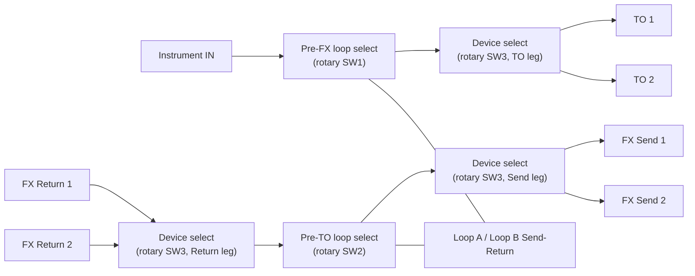

# 2 Lane Trafik

## Purpose

The 2 Lane Trafik is the multi-device version with two selectable device paths. It retains the two pedal-loop positions and adds a center device-selection footswitch. It has the same signal and loop behavior as the 4 Lane model, with two lanes rather than four.

## Panel layout and connections

Use a metal enclosure approximately 1590DD size or equivalent, subject to a full-size fit check.

- Right side: one **Instrument IN** jack.
- Upper-left bank: **FX Return 1** and **FX Return 2**.
- Upper-right bank: **FX Send 1** and **FX Send 2**.
- Left edge: Loop B Send/Return above Loop A Send/Return.
- Bottom bank: **TO 1** and **TO 2**.
- Across the middle: left **Pre-FX**, center **Device**, and right **Pre-TO** momentary footswitches.
- Indicators: four states for each loop position, located near the TO bank and between the FX banks; lane 1/2 indicators adjacent to the center switch.
- DC input on a side wall with clearance from audio wiring.

There are eleven audio jacks total: Instrument IN, two TO outputs, four device FX jacks, and four pedal-loop jacks. Use mono ¼-inch TS connectors. Label the FX jacks by lane and by direction from Trafik’s point of view as defined in the [architecture](architecture.md).

## Routing

Only one lane is connected at a time. For the selected lane:

`Instrument IN → Pre-FX position → TO n → device n input`

`device n FX Send → FX Return n → Pre-TO position → FX Send n → device n FX Return`

The unselected TO output and FX pair are isolated. Each outer footswitch selects Off, Loop A, Loop B, or A→B for its position. Loop A precedes Loop B when both are active. Each physical loop can be assigned to one position only; if both positions request the same loop, Pre-FX takes priority and the Pre-TO state indicator shows the applied, interlocked state.

## Footswitch and LED behavior

- **Left / Pre-FX:** cycles A → B → A+B → Off → repeat.
- **Center / Device:** selects lane 1 → lane 2 → lane 1.
- **Right / Pre-TO:** cycles A → B → A+B → Off → repeat.

Each loop position has four labeled indicators (Off, A, B, A→B). Two device indicators show the selected lane. One state per control is lit at a time. At power-up, both loop positions reset Off and lane 1 is selected. Momentary normally-open switches advance the hardware counters; they do not carry audio.

## Circuit Design

This section documents **Option A (mechanical stepping switch, default)**. See [architecture.md](architecture.md#circuit-design-principles) for the Option A/B distinction and shared conventions, and the "Hardware implementation" section below for Option B (relay-based).

### Signal path

### Loop switch logic table (SW1 = Pre-FX, SW2 = Pre-TO)

Identical to the Single Lane loop-select stage — see [single-lane-PLACEHOLDER.md](single-lane-PLACEHOLDER.md#switch-logic-table-per-position-sw1--pre-fx-sw2--pre-to) for the full 4-position table. Each position uses one 4-position, minimum 3-pole, non-shorting rotary switch (3P4T).

### Device (lane) switch logic table (SW3)

The device selector is one **2-position, minimum 3-pole (3P2T)** non-shorting switch — commonly built as a 3PDT footswitch/toggle, or a 2-position stop on a rotary switch, since only 2 throws are needed. Three ganged poles move together:

| Position | Pole 1 (TO) | Pole 2 (FX Return, into Pre-TO) | Pole 3 (FX Send, from Pre-TO) | Lane LED |
| --- | --- | --- | --- | --- |
| 1 | Pre-FX output → TO 1 | FX Return 1 → Pre-TO input | Pre-TO output → FX Send 1 | Lane 1 |
| 2 | Pre-FX output → TO 2 | FX Return 2 → Pre-TO input | Pre-TO output → FX Send 2 | Lane 2 |

Break-before-make contacts are required so TO 1/TO 2 (and FX Send 1/FX Send 2) are never briefly joined during a position change.

### Electronics needed

- 2 × 4-position, minimum 3-pole, non-shorting rotary switch (loop select).
- 1 × 2-position, minimum 3-pole, non-shorting switch (device select).
- 11 × mono ¼-inch TS jack (Instrument IN, TO 1–2, FX Send 1–2, FX Return 1–2, Loop A/B Send/Return).
- 10 × indicator LED (4 per loop position + 2 lane LEDs) with series resistors.
- Optional: 9 V battery or DC jack, only if LEDs are fitted.

See [electronics-reference.md](electronics-reference.md) for full specifications and this variant's exact quantities.

### LED wiring (Option A)

Loop-position LEDs follow the same table as [Single Lane](single-lane-PLACEHOLDER.md#led-wiring-option-a). Lane LEDs are wired to SW3's spare deck, one contact per lane:

| State | LED lit | Color |
| --- | --- | --- |
| Lane 1 | Lane 1 LED | White/blue (single color) |
| Lane 2 | Lane 2 LED | White/blue (single color) |

## Hardware implementation (Option B — relay-based, alternative)

Use fixed-function CMOS counters with debounced inputs, decoder/driver stages and electromechanical audio relays. Configure the device counter to wrap after lane 2. Relay contacts select the TO and matching FX Send/Return paths together; switching must be break-before-make so two devices are never temporarily tied together. Loop LEDs must reflect interlocked, applied routing. The unpowered relay state should bypass external loops and leave lane 1 as the passive fallback path.

## Build quantity and estimate

See the [BOM](bom-PLACEHOLDER.md) for line-item parts and retailer alternatives. The current planning estimate is **$188.80** before tax/shipping and **$217.12** with a 15% sourcing reserve. This estimate excludes tools, labor, and an external pedalboard power supply.

## Checkout

Test both lane positions and each paired TO/FX route with no device connected first. Check that switching never joins the two lanes, then verify all loop states, the duplicate-loop interlock, LEDs, power-up reset, and unpowered bypass. Use the [build guide](build-guide.md) for the full sequence.
